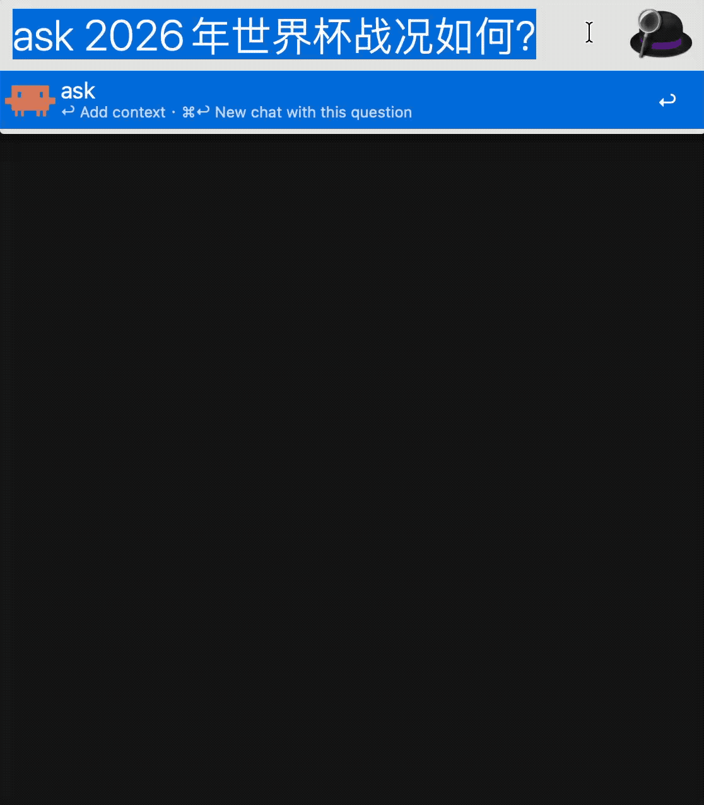

# Alfred Chat

Alfred 5 对话框聊天 Workflow，支持多 Provider 本地 Agent（文件 / Obsidian / 记忆 / 工具调用）。

## Demo

输入 `ask 你的问题` 直接开新对话（带上问题作为首轮上下文）：



## 安装

1. 下载 [`Alfred Chat.alfredworkflow`](Alfred%20Chat.alfredworkflow) 并双击安装。
2. 打开 Alfred Preferences → Workflows → **Alfred Chat** → **Configure**。
3. 选择 **Provider**，填入对应 API Key。

## 切换模型

在 **Alfred Preferences → Workflows → Alfred Chat → Configure** 里操作：

1. **换服务商**：改 **Provider**
   - `MiniMax` → MiniMax API（默认）
   - `DeepSeek` → DeepSeek API
   - `OpenAI` → OpenAI / OpenRouter 等兼容端点
   - `Anthropic` → Claude Messages API（非流式）
   - `Ollama` → 本机 Ollama（无需 API Key）
   - `Custom OpenAI` → 自定义 OpenAI 兼容端点
2. **换具体模型**：改对应 Provider 下的 Model 字段
3. **MiniMax 国内/国际**：改 **MiniMax Region**（国内 Key 通常选 `China`）

改完保存即可，下次 `chat` 提问立即生效。建议切换后按 **⌘↩** 开新对话，避免旧上下文混淆。

## 配置

| 选项 | 说明 |
|------|------|
| **Chat Keyword** | 触发关键词，默认 `chat` |
| **Provider** | `MiniMax` / `DeepSeek` / `OpenAI` / `Anthropic` / `Ollama` / `Custom OpenAI` |
| **OpenAI API Key** | [platform.openai.com](https://platform.openai.com/api-keys) 或 OpenRouter 等 |
| **OpenAI Base URL** | 默认 `https://api.openai.com/v1` |
| **OpenAI Model** | 默认 `gpt-4o` |
| **Anthropic API Key** | [console.anthropic.com](https://console.anthropic.com/) |
| **Anthropic Model** | 默认 `claude-sonnet-4-20250514` |
| **DeepSeek API Key** | [platform.deepseek.com](https://platform.deepseek.com/api_keys) |
| **DeepSeek Model** | 默认 `deepseek-v4-flash` |
| **MiniMax API Key** | [platform.minimax.io](https://platform.minimax.io/user-center/basic-information/interface-key) |
| **MiniMax Region** | 默认国内 `api.minimaxi.com`；国际 Key 改选 International |
| **MiniMax Model** | 默认 `MiniMax-M3` |
| **Ollama Base URL** | 默认 `http://localhost:11434/v1` |
| **Ollama Model** | 默认 `llama3.2` |
| **Custom OpenAI** | 自定义 Base URL / API Key / Model |
| **Keep History** | 新对话时归档当前会话 |
| **Context** | 发送给 API 的最近消息条数 |
| **Memory Nudge Interval** | 每 N 轮用户消息后触发后台记忆审阅（默认 10） |
| **Auto Memory Review** | 是否允许后台自动写入 MEMORY.md / USER.md |
| **Max Tool Iterations** | 模型驱动工具调用最多迭代次数（默认 5） |
| **Enabled Toolsets** | 工具集白名单：`all` / `read_only` / 逗号分隔（如 `file,obsidian,memory`） |
| **Context File Path** | 可选项目上下文文件（默认读 vault 根 `AGENTS.md`） |
| **Soul File Path** | Agent 灵魂文件（默认 `memories/SOUL.md`，类似 Hermes SOUL） |
| **Timeout** | 流式连接超时（秒） |
| **Your Name** | 对话里你的称呼，默认 `You` |
| **Assistant Name** | 对话里 AI 的称呼，默认 `Assistant` |
| **Obsidian Vault Path** | OB 库根目录，供 `/export` 与 OB 工具使用 |
| **Obsidian Export Folder** | 导出子文件夹，默认 `0.inbox` |
| **System Prompt** | 系统提示词 |

### Provider 说明

| Provider | 流式回复 | API Key |
|----------|----------|---------|
| MiniMax / DeepSeek / OpenAI / Ollama / Custom OpenAI | 支持 | 除 Ollama 外必填 |
| Anthropic (Claude) | 非流式（一次性返回） | 必填 |

Anthropic 通过 `provider_bridge.py` 调用 Claude Messages API，与 OpenAI 兼容端点分开处理。

### 对话排版说明

- **你和 AI 的称呼**使用一级标题（`#`），最醒目。
- **AI 回复里的标题**（如 `#`、`##`）会自动降 3 级显示，避免和称呼抢字号。
- **字体颜色**：Alfred Text View 只支持标准 Markdown，**不支持**自定义颜色（HTML 标签会原样显示）。可在 Text View 右上角 `···` 调整全局字号。

### 高级：Environment Variables

在 Workflow 右上角 `[x]` → **Workflow Environment Variables** 可覆盖端点：

- `deepseek_api_endpoint` — 默认 `https://api.deepseek.com/chat/completions`
- `minimax_api_endpoint` — 默认由 Region 决定

## 使用

### 触发方式

- 关键词：`chat 你的问题`
- 快捷键：**⌘2** — 打开最近一次对话（当前会话优先，否则加载最新归档）
- Universal Action：**Ask AI**
- Fallback Search：**Ask AI '{query}'**

### 对话框快捷键

| 快捷键 | 功能 |
|--------|------|
| ↩ | 发送新问题（继续当前会话） |
| ⌘↩ | 新对话：归档当前会话后发送（keyword 输入框与对话框内均可用） |
| ⌥↩ | 复制最后回答 |
| ⌃↩ | 复制全文 |
| ⇧↩ | 停止生成 |

### 重命名当前会话

在**对话框**里输入（不会发给 AI）：

```text
/rename 项目讨论
```

- 顶部会显示 `⌖ 项目讨论`
- 历史列表里也会用这个名称（优先于第一条问题）
- 只输入 `/rename` 会提示用法

### 回退对话片段（/rewind）

类似 Claude Code 的 `/rewind`，在对话框输入（不会发给 AI）：

| 命令 | 作用 |
|------|------|
| `/rewind` 或 `/rewind list` | 列出当前会话各轮编号 |
| `/rewind 1` | 删除最近 1 轮（一问一答） |
| `/rewind 3` | 删除最近 3 轮 |
| `/rewind to 2` | 只保留前 2 轮，后面全部删掉 |

适合答错方向时回退上下文，再继续问。

### 导出到 Obsidian（/export）

在对话框输入（不会发给 AI）：

| 命令 | 作用 |
|------|------|
| `/export` | 导出当前整段对话到 OB 库 |
| `/export 笔记标题` | 指定笔记标题（文件名）后导出 |

也支持自然语言（不会发给 AI），例如：

- `导出当前对话`
- `导出当前对话，命名为：哮喘与运动`
- `导出对话到 obsidian，标题：项目讨论`
- `export this conversation, named: Weekly review`

**注意**：需包含「导出 + 对话/聊天/会话」或 `/export`，避免和普通聊天里的「导出」一词混淆。

- 默认保存到 **Obsidian Vault Path** / **Obsidian Export Folder**（默认 `0.inbox/`）
- 文件名即笔记标题，如 `螨虫导致的哮喘用药.md`（同名时自动加 `-2`、`-3`）
- 导出成功后对话框回复 **已存入 done**

首次使用请在 Configure 里确认 **Obsidian Vault Path** 指向你的库根目录。

### 本机文件控制（自然语言）

支持在对话框直接用自然语言执行本机文件操作（不会发给 AI）。这部分由 `Workflow/local_agent.py` 处理，Alfred 负责展示对话，本地 Agent 负责解析、权限检查和真实文件操作：

- `创建文件 /Users/DRLer/tmp/note.md 内容：今天完成了复盘`
- `写入123.txt`
- `桌面写入123.txt`
- `在桌面新建123.txt`
- `在桌面新建123.txt 内容：hello`
- `追加 /Users/DRLer/tmp/note.md 内容：\n- 明天继续`
- `替换 /Users/DRLer/tmp/note.md 中 复盘 为 周复盘`
- `删除 /Users/DRLer/tmp/note.md`
- `列出桌面所有txt文件`
- `把桌面所有txt移动到 Desktop/txt归档`
- `读取123.txt`
- `搜索OB哮喘`
- `你能读到OB库的内容么？`
- `翻阅一下OB库里的日记`
- `读下最近2天日记`
- `列出0.inbox里的文章`
- `读取OB 10.DL日记/2026-06-17.md`
- `写入OB 0.inbox/test.md 内容：hello`
- `读下ob库今日日记`
- `今天日记 内容：今天完成 Alfred Chat 升级`
- `新增任务：整理桌面`
- `早上9点30提醒我打卡`（写入 macOS **提醒事项**）
- `明天下午3点提醒开会`
- `提醒我18:30取快递`
- `列出任务`
- `完成任务 1`
- `记住 资料库 是 /Users/DRLer/Obsidian_250614/3.wiki资料`
- `你记住以下内容：OB 指 Obsidian；CC 指 Claude Code`
- `列出记忆`
- `查看灵魂` / `设定灵魂 内容：...`（写入 `memories/SOUL.md`）
- `搜索对话 人均寿命` / `上次讨论过中国人均寿命吗`
- `运行命令：ls Desktop`
- `撤销上一步`

规则：

- 仅允许操作 `/Users/DRLer` 目录内文件
- 普通写入/追加/替换：直接执行
- 危险操作（删除文件、覆盖已存在文件）：会先提示，需输入 **确认执行**
- 输入 `取消` 可取消待执行危险操作
- 裸文件名默认指向桌面，例如 `写入123.txt` / `删除123.txt`
- 批量移动会先展示计划，确认后执行
- 每次写入/追加/替换/删除/批量移动会写操作日志，支持 `撤销上一步`
- Shell 仅允许白名单命令：`ls`、`pwd`、`mkdir`
- **OB 读写**：支持读取库状态、翻阅日记、读取最近日记、读写库内 Markdown 文件
- **提醒事项**：支持自然语言时间，写入系统「提醒事项」App（首次使用需授权）
- **长期记忆**（Hermes 风格）：`memories/MEMORY.md`（笔记）+ `memories/USER.md`（用户画像），`§` 分隔条目；自动从旧 `memory.json` 迁移
- **Agent 灵魂**（Hermes SOUL）：`memories/SOUL.md` 定义身份、性格与边界；首次使用自动按 **Assistant Name** 生成模板
- 每 N 轮对话后台 **自生长审阅**，可自动写入 `[auto]` 标记条目
- **会话检索**：`state.db` FTS 索引当前与归档对话
- `memories/MEMORY.md` 与 `USER.md` 会自动注入后续 AI 请求

### 模型驱动 Tool Use

普通请求会先由模型判断是否需要本地工具。模型只输出结构化 tool call，`Workflow/local_agent.py` 负责真实执行。例如：

- `帮我总结今日日记` → 模型选择 `obsidian_daily_read` → 读取本地 OB 日记 → 再由模型总结
- `帮我看看桌面123.txt写了什么` → 模型选择 `read_file`
- `把这个偏好记住：OB 就是 Obsidian` → 模型选择 `memory` add 或 `memory_append`
- `上次讨论过 X 吗` → `session_search`

### 聊天历史

输入 **`rename`** 直接浏览最近对话（可在 Configure 里改 **History Keyword**）。

- 列表顶部 **Current** = 当前进行中的会话
- 其余为已归档历史（⌘↩ 新对话时自动保存）
- 选中后 **↩** 加载该会话继续聊
- **⌘↩** 删除选中项（**Current** = 清空当前会话；已归档 = 移入废纸篓）

仍可用 `chat` + **⌥↩** 打开同一列表。

## API 对照

| Provider | Endpoint | 默认模型 |
|----------|----------|----------|
| OpenAI | `https://api.openai.com/v1/chat/completions` | `gpt-4o` |
| Anthropic | `https://api.anthropic.com/v1/messages` | `claude-sonnet-4-20250514` |
| DeepSeek | `https://api.deepseek.com/chat/completions` | `deepseek-v4-flash` |
| MiniMax 国际 | `https://api.minimax.io/v1/chat/completions` | `MiniMax-M3` |
| MiniMax 国内 | `https://api.minimaxi.com/v1/chat/completions` | `MiniMax-M3` |
| Ollama | `http://localhost:11434/v1/chat/completions` | `llama3.2` |

文档：[OpenAI API](https://platform.openai.com/docs/api-reference/chat) · [Anthropic API](https://docs.anthropic.com/) · [DeepSeek API](https://api-docs.deepseek.com/) · [MiniMax OpenAI API](https://platform.minimax.io/docs/api-reference/text-openai-api)

## 开发

```bash
# 从源码重新打包
cd Workflow && zip -r "../Alfred Chat.alfredworkflow" .
```

源码结构：

- `Workflow/chat` — 主 JXA 脚本（流式 API、工具路由、Provider 解析）
- `Workflow/local_agent.py` — 本地文件 Agent（工具解析、权限、执行）
- `Workflow/provider_bridge.py` — Anthropic 等非 OpenAI 兼容 API 桥接
- `Workflow/agent_tools/` — 工具注册表（15 个已注册工具）
- `Workflow/agent_providers/` — Provider Python 模块（供 bridge 调用）
- `Workflow/memory_store.py` / `soul_store.py` — 长期记忆与灵魂
- `Workflow/session_index.py` / `background_review.py` — 会话检索与后台审阅
- `Workflow/agent_skills/` — 技能检索与 skillify
- `Workflow/info.plist` — Workflow 对象与配置
- `scripts/test_*.py` — 本地测试脚本

## 致谢

基于 [alfredapp/openai-workflow](https://github.com/alfredapp/openai-workflow) 的 Text View + curl 流式架构改造。
